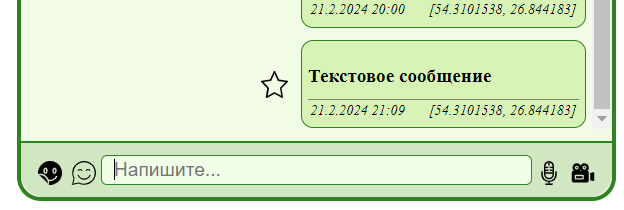

# Chaos Organizer

__Заппустить приложение:__   [Chaos Organizer](https://kohstantih.github.io/ahj-diploma-chaos_organizer/)

__Репозиторий серверной части проекта:__   [Backend](https://github.com/Kohstantih/ahj-diploma-chaos_organizer-backend.git)

__Органайзер:__ Позволяет собирать информацию, которая вам нужна, а он сортирует, обеспечивает поиск и хранение. Так же способен предоставить 
иныормацию сторонних сервисов по запросу.

## Описание возможностей Органайзера

### Основные инструменты управления

На изображении выделены основные инструменты управления органайзером.
В верхней части органайзера(Верхнее меню), cлева на право, расположены:
- Кнопка активации бота;
- Поле для ввода поисковых запросов;
- Кнопка загрузки и добавления файлов;
- Кнопка управления видимости боковой панели;
  
В нижней части органайзера расположены следующие элементы управления:
- Кнопка которая открывает меню добавления стикеров;
- Кнопка позволяющая добавить смайлы в текстовое сообщение;
- Поле воода текстовых сообщений;
- Кнопка начала записи голосового сообщения;
- Кнопка записи видеосообщения;

С правой стороны может быть открыто боковое меню, при помощи кнопки(см. описание верхнего меню);

### Добавление текстовой информации и ссылок

- Добавление текстового сообщения производится путем его ввода в специальное поле в нижнем меню:

После нажатия клавиши "ENTER", сообщение будет добавлено в список сообщений:

- Также к стекстовому сообщению можно добавить смайл, открыв меню выбора и кликнув по нужному смайлу:

- Отправив через текстовое поле ссылку, будет добавлено сообщение, клик по которому позволит перейти по этой ссылке:

