# Chaos Organizer

__Заппустить приложение:__   [Chaos Organizer](https://kohstantih.github.io/ahj-diploma-chaos_organizer/)

__Репозиторий серверной части проекта:__   [Backend](https://github.com/Kohstantih/ahj-diploma-chaos_organizer-backend.git)

__Органайзер:__ Позволяет собирать информацию, которая вам нужна, а он сортирует, обеспечивает поиск и хранение. Так же способен предоставить 
информацию сторонних сервисов по запросу. Приложение синхронизировано, если оно открыто на нескольких устройствах, то контент обновляется синхронно на всех. Информация хранится в виде сообщений, сначала подгружаются последние 10 сообщений, при прокрутке вверх подгружаются следующие 10 и т. д.

## Описание возможностей Органайзера

### Основные инструменты управления

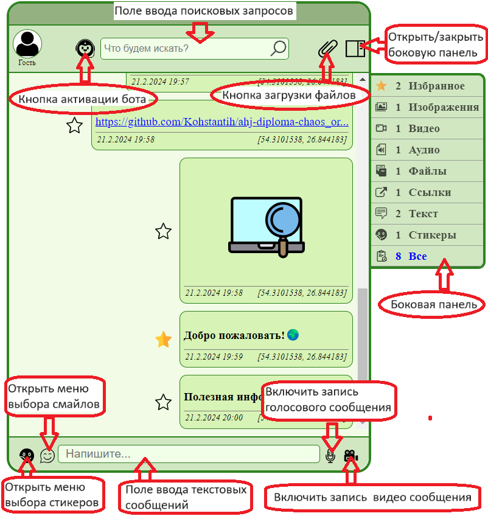

На изображении выделены основные инструменты управления органайзером.
В верхней части органайзера(Верхнее меню), cлева на право, расположены:
- Кнопка активации бота;
- Поле для ввода поисковых запросов;
- Кнопка загрузки и добавления файлов;
- Кнопка управления видимости боковой панели;
  
В нижней части органайзера расположены следующие элементы управления:
- Кнопка которая открывает меню добавления стикеров;
- Кнопка позволяющая добавить смайлы в текстовое сообщение;
- Поле воода текстовых сообщений;
- Кнопка начала записи голосового сообщения;
- Кнопка записи видеосообщения;

С правой стороны может быть открыто боковое меню, при помощи кнопки(см. описание верхнего меню);

### Добавление текстовой информации и ссылок

- Добавление текстового сообщения производится путем его ввода в специальное поле в нижнем меню:

После нажатия клавиши "ENTER", сообщение будет добавлено в список сообщений:

- Также к стекстовому сообщению можно добавить смайл, открыв меню выбора и кликнув по нужному смайлу:

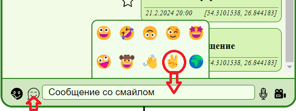

- Отправив через текстовое поле ссылку, будет добавлено сообщение, клик по которому позволит перейти по этой ссылке:

### Стикеры

Окно выбора стикеров откроется после клика по кнопке в нижнем меню:

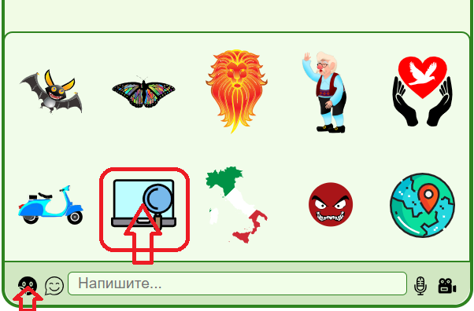

Кликнув по нужному стикеру, он будет добавлен в виде отдельного сообщения:

### Голосовые и видеосообщения

При нажатии на кнопку с изображением микрофона начнется запись голосового сообщения, соответственно для записи видео сообщения нужно нажать на
кнопку с изображением видео камеры. Кнопки расположены в нижнем меню справа. (Необходимо предоставить доступ к камере и микрофону)

После начала записи, в нижнем меню появится панель управления.
- Слева кнопка сохранения записи, добавит сообщение.
- В центре таймер отсчета времени записи.
- Справа кнопка отмены записи.

При записи видеосообщения также откроется окно предварительного просмотра.

После подтверждения записи, сообщения будут добавлены как медиа, их можно прослушать и просмотреть.

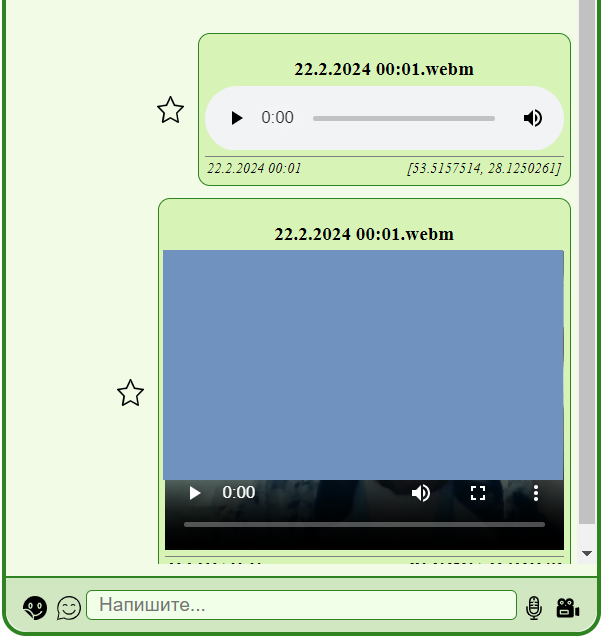

В качестве названия будет использоана дата записи, а также формат файла.

### Сохранение файлов в истории

Добавление файлов производится через нажатие кнопки в виде "скрепки", расположенной в верхнем меню, и дальнейшем выборе нужного файла.
Также файлы можно добавить перетащив и отпустив над списком сообщений.

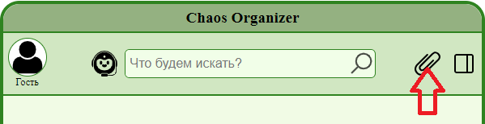

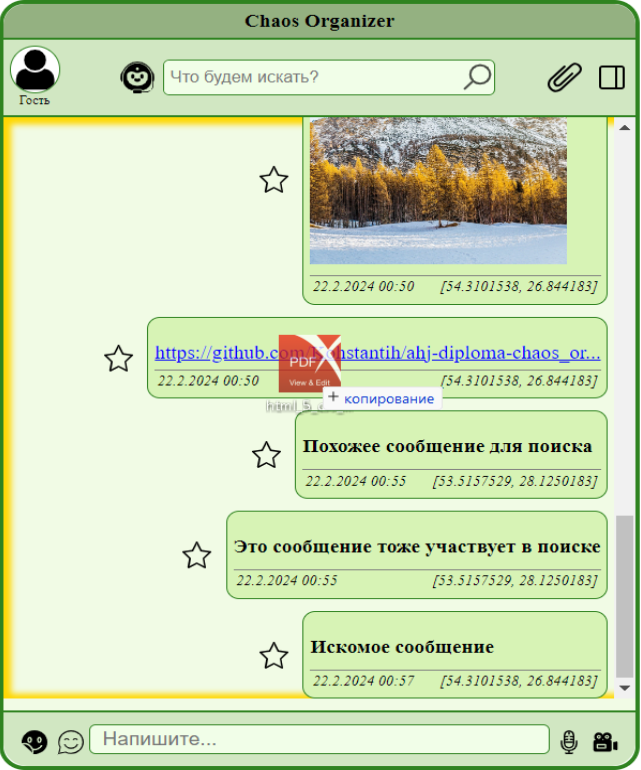

Файлы будут сохранены в истории, в соответствующей категории. И отобразятся в списке сообщений.

### Боковая панель.

Открыть / скрыть боковую панель можно нажатием на кнопку в верхнем меню:

В боковой панели расположен список категорий, по которым распределяются файлы.
Также указывается количество сообщений в данной категории.
При клике на нужной категории, список видимых сообщений отсортируется соответственно.
Например, при выборе категории "Файлы":

### Информация о дате и месте

В нижней части сообщения размещена информация о дате создания и координатах места.

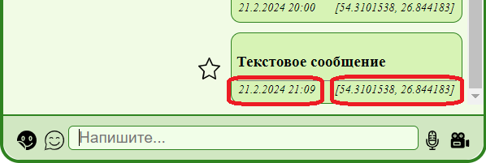

Время определяется автоматически. Информацию о координатах можно предоставить разрешив браузеру это делать или ввести в ручную во всплывающем окне.

### Управление сообщениями

__Взаимодействие с сообщением:__
- __Добавление в избранное__
- __Удаление;__
- __Закрепление;__
- __Скачивание(для файлов)__
  
#### Добавление в избранное

С левой стороны от сообщения расположена кнопка-статус, клик по ней меняет этот статус.

При наведении мыши на сообщение в правом верхнем углу отобразяться кнопки управления.

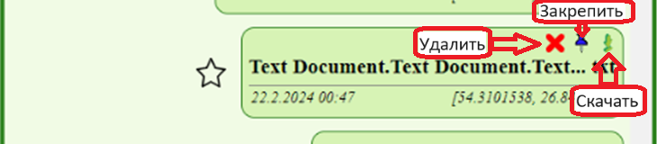

Добавление в избранное, позволяет позже отфильтровать сообщения по этой категории, открыв боковую панель.

#### Удаление

Удаление сообщения из списка, а также из истории

#### Закрепление

Закрепленное сообщение будет отображаться поверх остальных сообщений, в верхней части списка. В качестве описание сокращенная
версия текстового сообщения, или название файла.
При клике по закрепленной версии сообщения отобразится его полная версия, в списке.
В правом верхнем углу, при наведении указателя мыши, отображается кнопка удаления из закрепленных сообщений. Одновремено может быть закреплено только одно сообщение.

#### Скачивание

Работает с файлами.

### Поиск сообщений в истории

В верхнем меню расположено поле ввода поисковых запросов.

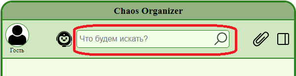

Если сообщение текстовое, поиск производится непосредственно по самому сообщению, файлы могут быть найдены по имени файла, стикеры в поиске не участвуют.
После ввода нескольких символов и небольшой паузы(0.5 секунды), начнётся поиск по запросу, в выпадающем списке будут показаны результаты поиска, с краткой информациеей о найденых сообщениях.

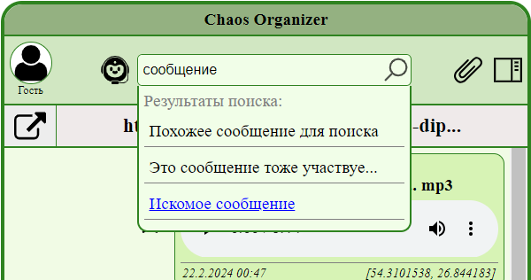

Кликнув по нужному, искомое сообщение отобразится в общем списке.

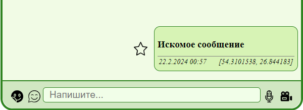

### Команды боту

В верхнем меню расположена кнопка активации бота. При нажатии на неё откроется поле для ввода команд боту.

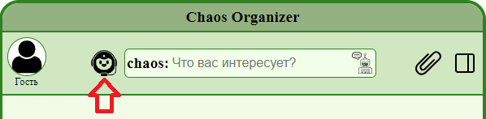

__Список команд:__
- **_погода_** (погода на текущий момнт времени)
- **_валюта_** (курсы валют)
- **_новости_** (последние новости)
- **_афиша_** (расписание ближайших фильмов)
- **_картинка_** (случайная картинка)

Ввести команду и нажать клавишу ENTER. Ниже откроется окно с необходимой информацией.
Например "погода", получим:

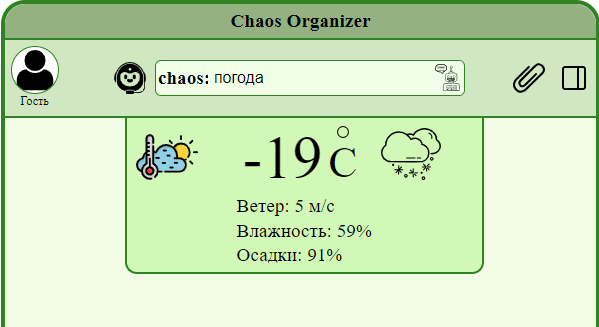
